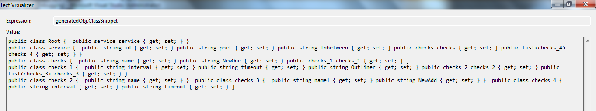
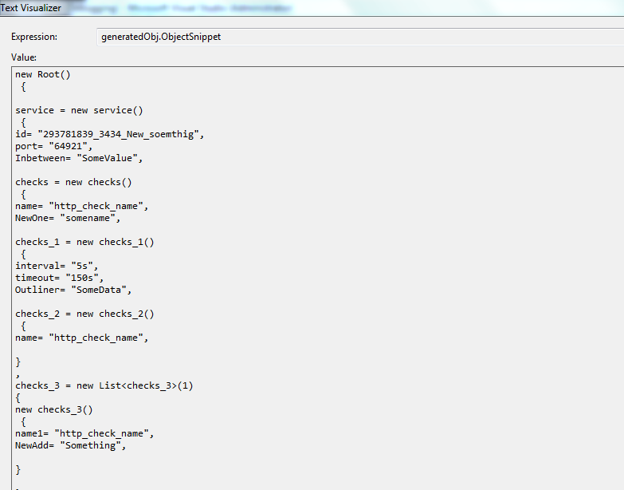
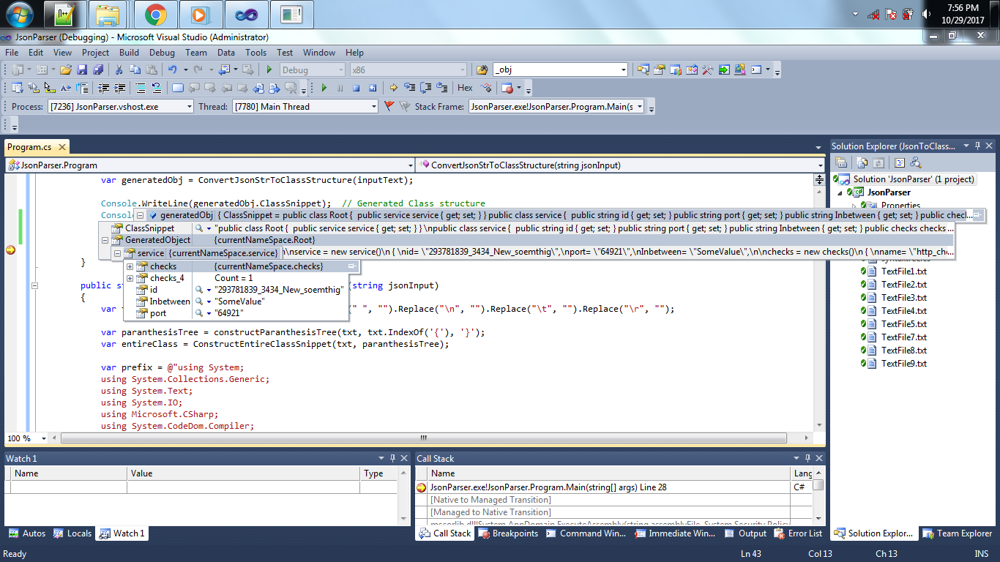
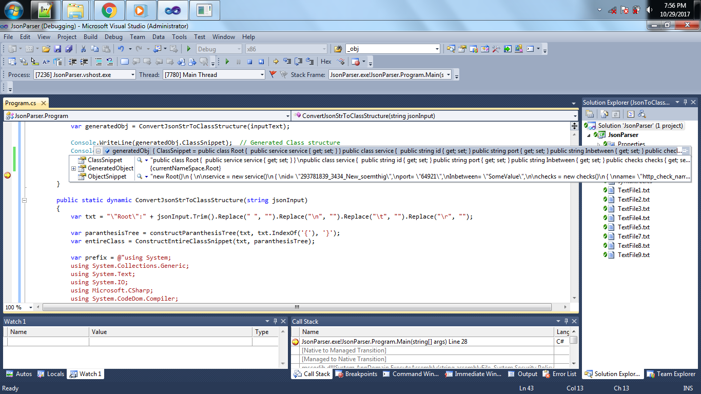

# JsonToClassParser
<b>Prerequisite:-</b> 
	Before going thorough this branch, check out the master branch's readme.md file for more info.
	
<b>What's new in this latest update?</b> 
   Well, still the same restriction done in the master will apply to this one too.
   
   But over here, there are some addons have been added.
   
   1. Equivalent Class Structure for the Json Structure (- No change here, as this is in master branch)
   2. Equivalent Object initialization code for the generated class (New addon)
   3. Runtime generated object with equivalent values given in the json (New addon)
   
<b>Hey, this is already done, What the hell u did something new here?</b> 
   Yes, there is already NewtonSoft, DataContract api's are there. I did not do anything anything new here. I have written just a code base which can be used by anyone. 
   
<b>Any Samples available for this new changes?</b> 
   Yes. Here you go.  
   <b>1. A sample snapshot showing the raw class structure generated</b>   
   
     
   <b>2. A sample snapshot showing, the runtime object initialization snippet for the equivalent class generated with supplied values from Json</b>   
   
        
   <b>3. A sample snapshot showing the runtime object generated from json supplied</b>   
   
     
   <b>4. A sample snapshot showing the overview of all objects generated which contains all 3 (1.Class structure, 2.Runtime Object, 3. Runtime object initialization construct) </b>   
   
     
   
<b>What change can I see in another repo?</b> 
   Planning to remove the restriction since it is almost coming to end.
   
<b>What else for me?</b> 
   Thanks for your time. Ping/Comment if u found anything wrong/bug in this one. Have a good day. Bye.   
   
   
