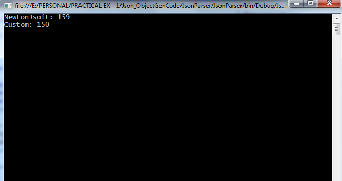

# JsonToClassParser

<b> What's in this branch? </b>  
   You can get the run time C# object initialized from the input Json string. 
  
<b>Aw, Really? No restrictions? </b> 
    Almost cleared the restrictions.  
    1. As of now, I have one restriction. Only Key Value pair I am processing. No values without key will be processed  
    2. Take care while defining the class. As of now I am not taking care of the implicit conversion when the supplied json value data type 
    and the declared C# prop type are different. Finally u will get the runtime exception.! 
    
<b> Snap, Is there any improvements that I can get from this branch? </b>  
   Yes. One more surprise. The code is coding better than the NewtonSoft api Call. But I am looking on this one. Here is the place where my code performs better.
   In each fresh run, my code will  be at par/ or better than the NewtonSoft conversion. 
   
   Want to know more?  https://stackoverflow.com/questions/47152633/how-jsonconvert-deserializeobject-is-working-internally 
   Take a look at this one.
   
 <b> Any snaps to show here? </b>  
 Yes. Of course. Here you go! These images are taken at each successive run (doing a application restart each time)  
 
 
 
 
 
 
 A snap from the Ant Performance profiler too! 
 
 
 Grt. Profiler says that JsonConvert.DeserializeObject is taking some 700+ MSec where as my code took some 400 + Msec! 
 
 <b> Are you sure that, your shit code will do better than NewtonSoft api?</b>  
 Not sure on this one. Working on this, to find how the Newtonsoft is working internally.
  
So, I am left with no clue on, 
1. How it is parsing the string to C# in negligible time in successive run 
2. How it is taking some time for parsing in first run/ or how it is taking time in parsing for each restart of the application. 

As of now, I can able to understand that, Newtonsoft is caching the input and result. Looking on its behaviour for the above points.

To understand the above points, pls look once the SO link, which is given in the top of this ReadMd.

<b>Ok, anything else for me? </b> 
As usual, Thx for stopping by. If any suggestions/input feel free to drop here. Have a nice day ahead. Bye. See u soon in the another brach.
